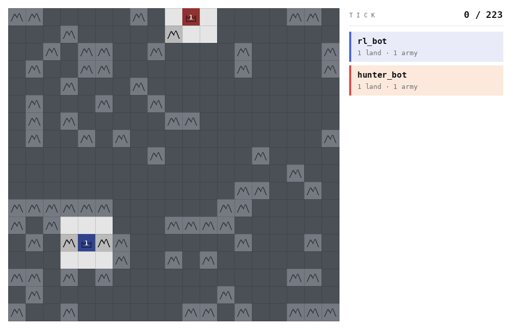
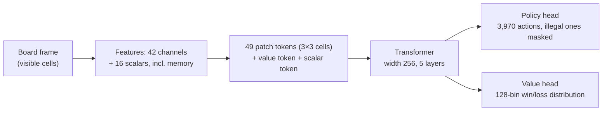
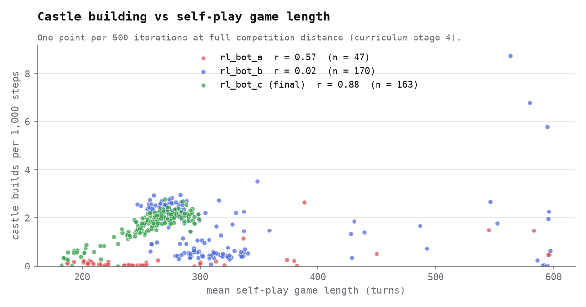
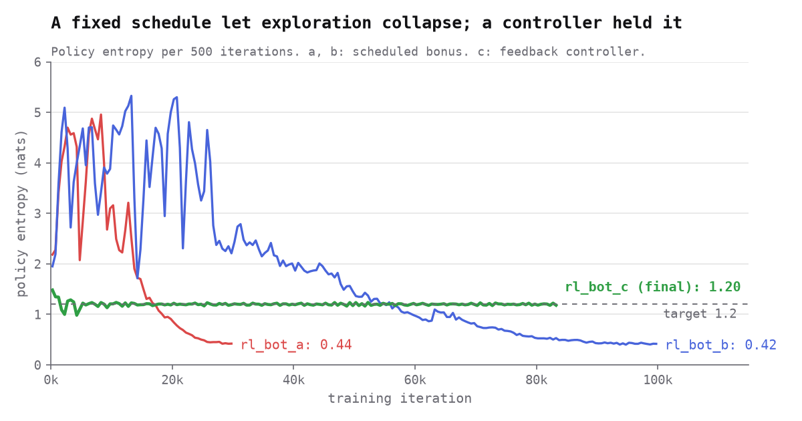

# Generals Bot Competition: a self-play RL agent

Team **ah** (Artem Hontarenko and Semen Skrypnykov) took part in the
[Generals Bot Competition](https://www.generals.bot) by Equilibre × ÚFAL in July–September 2026.
The prize pool was $18.3k. Our final bot finished **23rd of 155 teams**.

The competition was a good chance to learn deep RL properly. Here we built a PPO self-play agent in JAX. We used
[Claude Code](https://claude.com/claude-code) as a coding assistant to write the code.



## The game

Bots play a two-player variant of [generals.io](https://generals.io). Each player starts with
one general. You win when you capture the enemy general. The full rules are on the
[competition site](https://www.generals.bot/docs). Two rules differ from classic generals.io:

- **You build castles.** The map has no neutral castles. A castle costs at least 35 army.
  It then produces 1 army every 2 turns, as much as 25 ordinary tiles.
- **Deathtouch.** From turn 800, any move onto the enemy general wins the game at once. After 1200 turns the game ends with a draw. 

Other limits: fog of war and 150 ms per move on one CPU core.

## Two directions

During the competition, we explored two possible approaches for implementing a bot. I explored classic deep RL. My approach followed
[AverageJoe](https://github.com/strakam/AverageJoe), the organisers' reference RL bot.
My teammate explored a physics direction where bots were modeleted as systems from statistical physics. That direction did
not work out, physics-based bots played considerably worse than the AverageJoe approach.

## AverageJoe in brief

Our bot was heavily inspired by the AverageJoe paper,
[Straka, Lisý & Schmid (2026)](https://arxiv.org/abs/2606.23348). That paper in turn took
plenty of ideas from the Stratego paper by
[Sokota et al. (2025)](https://arxiv.org/abs/2511.07312). AverageJoe is a transformer policy
trained with PPO self-play. It reached #1 on the public generals.io 1v1 ladder. The table
compares it with our final bot. The AverageJoe column comes from the paper (Tables II and V)
and from its released configuration
([`L_7d_gae90.yaml`](https://github.com/strakam/AverageJoe/blob/main/configs/custom/L_7d_gae90.yaml)).

| Property | AverageJoe | Our final bot |
| --- | --- | --- |
| Network | transformer, width 448, 7 layers, 8 heads | transformer, width 256, 5 layers, 8 heads |
| Parameters | 15.35M | 3.5M |
| Value head | 128-bin distribution (HL-Gauss) | 128-bin distribution (HL-Gauss) |
| Board padding | 24 × 24 | 21 × 21 |
| Data per iteration | 512 games × 512 steps | 256 games × 256 steps |
| Training compute | 4 days on 4 NVIDIA H200 GPUs | 94 hours on one GPU (83,396 iterations) |
| Reward | win/loss only | win/loss plus shaping (see rl_bot_c) |
| Exploration term | entropy bonus in the paper; hand-made move prior in the code | entropy held at a target |


Our version of the architecture is below. AverageJoe's own diagram is
[here](https://github.com/strakam/AverageJoe/blob/main/assets/architecture.png).



## Rebuilding AverageJoe

To understand AverageJoe, we rebuilt it from scratch. Two details caught our attention.

**One pass action, not hundreds.** In the published implementation, AverageJoe gives every cell a "pass" action. On a
24 × 24 board, that is 576 actions that all do the same thing. At the start of training
they hold about 11% of the probability, so the policy is pushed toward passing. Under
deathtouch, a passing habit loses games. We use a single pass action.

**A hand-made prior in the loss.** The paper says the agent learns "without any human
demonstrations or hand-engineered priors". It also says that they "kept plain entropy".
That is true for human data: the agent never sees a human game. But the released training
code has no plain entropy bonus. In its place, it always pulls the policy toward a hand-made
"expander" prior. This prior gives fixed scores to moves: castle captures 5, enemy captures 3,
neutral captures 2, other moves 1, pass 0.2. So hand-crafted move values shape the policy.
We started with a plain entropy bonus instead.

## The journey: five bots

We trained six runs on the MetaCentrum GPU cluster.
Five of them are bots in this story.

### rl_bot_a: the baseline 

We made the network smaller than AverageJoe, so that it answers within 150 ms on one CPU core:

- width 256 and 5 layers, not 448 and 7: 3.4M parameters, not 15.35M;
- a plain value head with a squared-error loss, not the 128-bin HL-Gauss head;
- four summary numbers about the opponent's army and land, not a learned history encoder;
- a plain entropy bonus, not the hand-made prior;
- one pass action.

We trained it for 30,000 iterations. A curriculum started with the two
generals close together and moved them apart in five stages. The bot learned to win, but it
almost never built a castle(about one build in 60 games). Its policy also became nearly
deterministic, so it stopped exploring.

Against our heuristic `hunter_bot`, it scored **39 wins, 1 draw, 0 losses** in 40 games.

### rl_bot_b: castle inputs 

We added three input channels about castles. They show the cost to capture each cell, the
payback of building on each of our cells, and the remaining value of every castle.
We trained for 100,000 iterations.

As was mentioned in other write-ups, castles-building policy separated the top bots from the rest. The team in joint 5th place
[writes](https://jackfrigaard.com/generals-bot-competition/) that its bot "was never building
castles" at first. Castles "take a long time to pay off, so they are hard to discover".
They fixed it by pulling the policy toward a behaviour-cloned expert for a short time.

Our bot had the same problem. A castle needs about 70 turns to repay its cost. But our
advantage estimates looked only about 10 steps ahead (γ = 1, λ = 0.9). So the reward for
a castle had to come through the critic, and the critic was weak. Also, self-play games were
short, so the bot decided to spend army on land than on a castle.



**Reading the plot.** Each point is the average over 500 training iterations at full
competition distance. For `rl_bot_c` (green), the build rate rises with game length
(r = 0.88): the bot builds castles only when games last long enough to repay them.
`rl_bot_a` (red) almost never built, whatever the game length. `rl_bot_b` (blue) shows no
clear link (r = 0.02). Its games longer than 400 turns all come from iterations 4,000–25,000.
There, its entropy was 4.2 nats: the play was close to random, not a slow economic game.

The new inputs gave 40× more builds, but still only 0.6 castles per game.
`rl_bot_b` beat `hunter_bot` 40–0 and `rl_bot_a` 36–4.

### rl_bot_c: reward shaping 

The main change was **potential-based reward shaping**. Besides the win or loss, the bot gets
a small reward when its lead over the opponent grows in land, army and castles. This kind of
shaping does not change which policy is best (Ng et al., 1999). It only gives credit
earlier. The earlier generals.io agent by
[Straka & Schmid (2025)](https://arxiv.org/abs/2507.06825) used the same idea. The AverageJoe
paper uses win/loss only: at its much larger throughput, shaping hurt late in training.
We did not test shaping on its own: `rl_bot_c` changed three things at once.
We also made two smaller changes:

- the 128-bin HL-Gauss value head came back;
- an entropy controller replaced the fixed schedule. It holds the policy entropy at 1.2 nats.



**What the plot shows.** Entropy measures how spread out the policy is over its moves.
High entropy means the bot tries many different moves. Low entropy means it almost always
plays the same move. As a rough guide, e^entropy is the number of moves the bot really
considers. At the start, all 3,970 actions are equally likely: 8.29 nats.

**What it means.**

- `rl_bot_a` (red) and `rl_bot_b` (blue) used an entropy bonus that shrank on a fixed
  schedule. Their entropy fell to about 0.4 nats: roughly 1.5 moves considered per turn.
  The policy became almost deterministic, so it stopped exploring. A bot that never tries a
  castle cannot learn that castles pay.
- The fall followed the schedule, not the learning progress. Exploration ended because the
  bonus got small, not because the bot had found good play.
- The early swings of red and blue (2–5 nats) hurt the curriculum. When entropy was high,
  play was close to random and few games finished inside a rollout. The curriculum then
  stepped back a stage. In the first 30,000 iterations of `rl_bot_b`, entropy and the share
  of finished games correlate at r = −0.82. The curriculum changed stage 14 times in
  `rl_bot_a` and 32 times in `rl_bot_b`.
- `rl_bot_c` (green) used a feedback controller. Each iteration, it raises the bonus if
  entropy is below 1.2 nats and lowers it if entropy is above. Entropy stayed at 1.2 nats
  (about 3.3 moves) for the whole run, and the curriculum changed stage only 4 times.

We trained for approximately 80,000 iterations. At one point, `rl_bot_c` was the 13th best
bot on the live leaderboard. It attacked well, but it did not learn the castle economy:
0.1–0.3 castles per game in our tests. This gap separates it from the top bots.

`rl_bot_c` was our final submission. In this repository, it is `bots/rl_bot`. It beat
`hunter_bot` 40–0, `rl_bot_a` 39–1 and `rl_bot_b` 35–5.

## What failed

- **Wider layers.** following the scalling laws, we tried to increase the number of neurons in the layers, but due to the limited computations and time the larger model failed to arrive to the better policy compared to `rl_bot_c`. 
- **Physics-based bots.** See [Two directions](#two-directions).
- **No pool of past opponents.** Every run played only against itself. Once our bots beat
  the baselines, we could not rank them without separate head-to-head matches.


## The harness and results

`evaluation/` plays matches between any two bots. It uses fixed map seeds and plays each
seed from both seats, so map luck cancels. It reports a score (win 1, draw 0.5), a 95%
Wilson interval, end reasons, reply times and replays.

Each row is 40 games on competition boards. Full reports are in
[`results/crossplay.md`](results/crossplay.md).

| Bot | Opponent | Score [95% CI] | W / D / L |
| --- | --- | --- | --- |
| `rl_bot_a` | `hunter_bot` | 0.988 [0.891, 0.999] | 39 / 1 / 0 |
| `rl_bot_b` | `hunter_bot` | 1.000 [0.912, 1.000] | 40 / 0 / 0 |
| `rl_bot` (c) | `hunter_bot` | 1.000 [0.912, 1.000] | 40 / 0 / 0 |
| `rl_bot_b` | `rl_bot_a` | 0.900 [0.769, 0.960] | 36 / 0 / 4 |
| `rl_bot` (c) | `rl_bot_a` | 0.975 [0.871, 0.996] | 39 / 0 / 1 |
| `rl_bot` (c) | `rl_bot_b` | 0.875 [0.739, 0.945] | 35 / 0 / 5 |

`hunter_bot` is a simple heuristic. It keeps a garrison on its general and pushes one stack
at the enemy general. `rl_bot` answers a move in about 10 ms at the median.

## Repository

```
agent/          the RL agent: features, network, PPO training, NumPy inference
bots/           rl_bot (final, = rl_bot_c), rl_bot_a, rl_bot_b, hunter_bot, random_bot
evaluation/     the match harness
competition/    two unchanged files from the competition engine
results/        cross-play reports, training-curve extract, figures and their scripts
tests/          tests for the agent and the harness
```

```bash
pip install -e '.[test,plots]'
python -m evaluation.evaluate bots/rl_bot bots/hunter_bot --suite smoke
pytest tests
```

The game engine is the organisers' [generals-bots](https://github.com/strakam/generals-bots)
(MIT), used unchanged.
